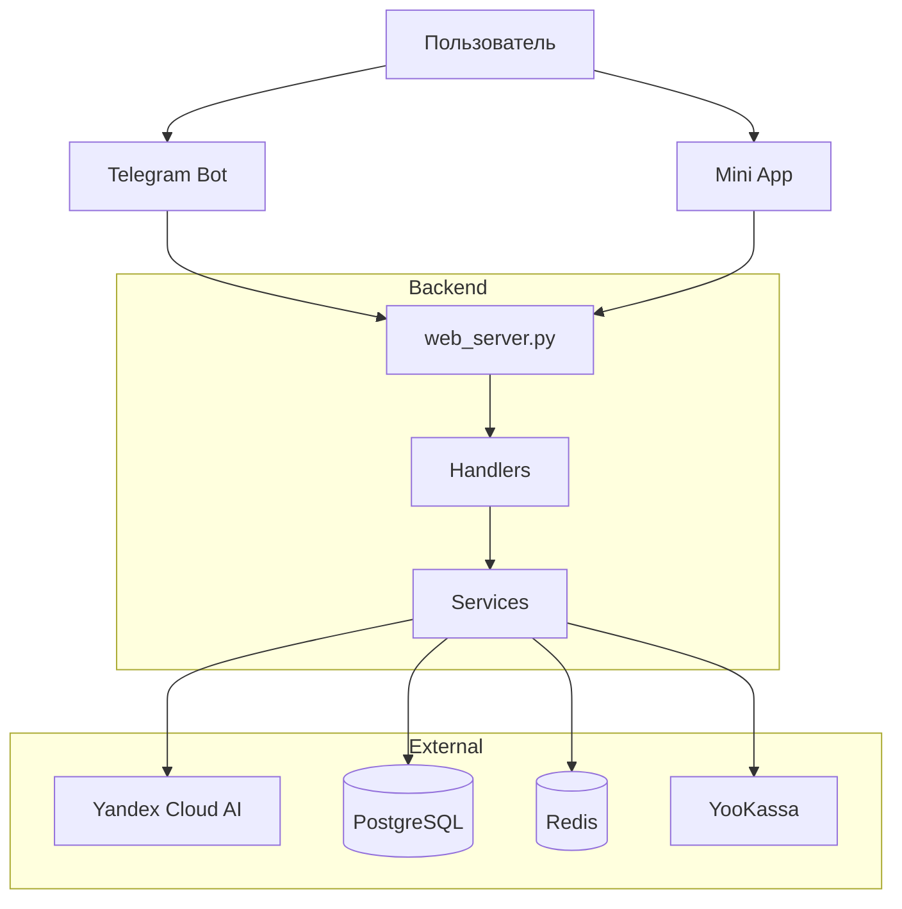

<div align="center">


# PandaPal

Образовательная платформа для школьников 1-9 классов с Telegram-ботом и веб-приложением. Помогает детям учиться по всем предметам с защитой от небезопасного контента.

[](https://www.python.org/)
[](https://reactjs.org/)
[](https://www.typescriptlang.org/)
[](https://github.com/psf/black)
[](https://github.com/pre-commit/pre-commit)
[](https://railway.app)
[](LICENSE)

[Сайт](https://pandapal.ru) • [Telegram Бот](https://t.me/PandaPalBot)

</div>

## О проекте

PandaPal — интеллектуальный помощник для помощи в учебе. Бот работает 24/7 и помогает детям с домашними заданиями, объясняет сложные темы и поддерживает изучение иностранных языков.

## Быстрый старт

Для локальной разработки:

```bash
# Клонирование репозитория
git clone https://github.com/gaus-1/pandapal-bot.git
cd pandapal-bot

# Установка зависимостей Python
python -m venv venv
source venv/bin/activate  # Windows: venv\Scripts\activate
pip install -r requirements.txt

# Настройка окружения
cp config/env.template .env
# Заполните .env файл с вашими API ключами

# Миграции БД
alembic upgrade head

# Запуск backend
python web_server.py

# В другом терминале - запуск frontend
cd frontend
npm install
npm run dev
```

Полная документация по установке и настройке: см. [docs/](docs/)

### Ключевые возможности

- **Интеллектуальный помощник премиум качества** — глубокие структурированные ответы на базе YandexGPT Pro с учетом ВСЕХ слов запроса, развернутые объяснения как у лучших репетиторов
- **Помощь по ВСЕМ школьным предметам** — математика, алгебра, геометрия, русский, литература, английский, немецкий, французский, испанский, история, обществознание, география, физика, химия, биология, информатика, окружающий мир
- **Визуализации по всем предметам** — графики функций, таблицы умножения/сложения/деления, карты стран и городов с границами, климатограммы природных зон, блок-схемы алгоритмов, графики плавления и нагревания, периодическая таблица Менделеева
- **Проверка домашних заданий** — фото условия + своё решение → панда проверит, найдет ошибки, исправит и объяснит
- **Фото задач** — распознавание текста из учебников и тетрадей через Vision API с объяснением решения
- **Голосовые вопросы** — распознавание речи через SpeechKit STT с подробным текстовым ответом
- **Генерация изображений** — создание картинок по описанию через YandexART
- **Объяснение взрослых тем** — деньги, банки, налоги, ЖКУ, документы, здоровье простыми словами для подготовки к взрослой жизни
- **Адаптивное обучение** — отслеживание проблемных тем, автоматическая адаптация сложности под уровень ученика
- **Enhanced RAG система** — умный поиск по базе знаний с семантическим кешированием и контекстной компрессией (сокращение объёма контекста 75–90%)
- Streaming ответы через Server-Sent Events для мгновенной генерации
- Автоматический перевод и объяснение грамматики для 5 языков
- Игры PandaPalGo: Крестики-нолики, Шашки с умным противником, 2048, Эрудит (составление слов)
- Система достижений и прогресса с XP, уровнями и наградами
- Premium подписки через YooKassa с сохранением карт
- Многоуровневая модерация контента для безопасности детей (150+ паттернов)
- Темная тема для комфортного использования

## Технологии

### Backend

- Python 3.13, aiogram 3.23, aiohttp 3.13
- SQLAlchemy 2.0, PostgreSQL 17, Alembic
- Redis 6.4 для сессий (Upstash)
- Yandex Cloud: YandexGPT Pro, SpeechKit STT, Vision OCR, Translate API
- YooKassa 3.9.0 для платежей (продакшн режим)
- Параметры генерации: temperature=0.3, max_tokens=2000

### Frontend

- React 19, TypeScript 5, Vite 7
- TanStack Query 5, Zustand 5
- Tailwind CSS 3
- Telegram Mini App SDK 8.0

### Инфраструктура

- Railway.app для хостинга (webhook режим, 24/7)
- Cloudflare для DNS, SSL, CDN
- GitHub Actions для CI/CD
- Upstash Redis для сессий
- Keep-alive механизм для предотвращения сна на Railway FREE

## Структура проекта

```
PandaPal/
├── bot/                     # Backend логика
│   ├── handlers/            # Обработчики команд Telegram
│   │   ├── ai_chat/         # Модульная структура AI чата
│   │   │   ├── text.py      # Текстовые сообщения
│   │   │   ├── voice.py     # Голосовые и аудио
│   │   │   ├── image.py     # Изображения
│   │   │   ├── document.py  # Документы
│   │   │   ├── helpers.py   # Вспомогательные функции
│   │   │   └── __init__.py  # Регистрация router
│   │   ├── start.py         # Команда /start
│   │   └── ...              # Остальные handlers
│   ├── services/            # Бизнес-логика (AI, платежи, игры, Mini App, RAG)
│   │   ├── ai_service_solid.py          # Фасад над Yandex Cloud AI
│   │   ├── yandex_cloud_service.py      # Низкоуровневый Yandex Cloud клиент
│   │   ├── yandex_ai_response_generator.py  # Генерация AI ответов с RAG
│   │   ├── rag/                         # Enhanced RAG система
│   │   │   ├── query_expander.py        # Расширение запросов (multi-query)
│   │   │   ├── reranker.py              # Переранжирование результатов
│   │   │   ├── semantic_cache.py        # Семантическое кеширование
│   │   │   ├── compressor.py            # Контекстная компрессия (75-90%)
│   │   │   └── __init__.py              # Экспорт RAG компонентов
│   │   ├── miniapp_chat_context_service.py  # Контекст чата для Mini App
│   │   ├── miniapp_intent_service.py        # Детекция intent'ов (таблицы, графики и т.п.)
│   │   ├── miniapp_audio_service.py         # Обработка аудио из Mini App
│   │   ├── miniapp_photo_service.py         # Обработка фото/домашки из Mini App
│   │   ├── miniapp_visualization_service.py # Детектор визуализаций для Mini App
│   │   ├── visualization_service.py         # Единая точка входа для визуализаций
│   │   ├── visualization/                   # Генерация графиков/таблиц по предметам
│   │   ├── homework_service.py              # Проверка домашних заданий по фото
│   │   ├── adaptive_learning_service.py     # Адаптивное обучение, проблемные темы
│   │   ├── games_service.py                 # Игры PandaPalGo (TicTacToe, Checkers, 2048, Erudite)
│   │   ├── gamification_service.py          # Достижения, уровни, XP
│   │   ├── premium_features_service.py      # Premium лимиты и доступ
│   │   ├── payment_service.py               # YooKassa / Telegram Stars
│   │   ├── history_service.py               # История чата (включая image_url)
│   │   ├── adult_topics_service.py          # Объяснение взрослых тем детям (деньги, ЖКУ, документы)
│   │   ├── yandex_art_service.py            # Генерация изображений через YandexART
│   │   └── token_rotator.py                 # Ротация ключей API
│   ├── api/                # HTTP endpoints
│   │   ├── miniapp/        # API для Telegram Mini App
│   │   │   ├── chat_stream.py   # Streaming AI чат (SSE) + визуализации
│   │   │   ├── homework.py      # Проверка домашних заданий (check, history, statistics)
│   │   │   ├── other.py         # История чата, предметы, логирование
│   │   │   └── __init__.py      # Регистрация Mini App маршрутов
│   │   ├── games_endpoints.py   # API для игр
│   │   ├── premium_endpoints.py # Премиум и платежи
│   │   └── auth_endpoints.py    # Telegram Login / auth API
│   ├── config/             # Настройки, промпты, паттерны модерации
│   ├── security/           # Middleware, валидация, rate limiting
│   ├── monitoring/         # Метрики, мониторинг
│   ├── interfaces.py       # Интерфейсы сервисов (SOLID)
│   ├── decorators.py       # Декораторы для логирования
│   ├── models.py           # SQLAlchemy модели БД
│   └── database.py         # Подключение к PostgreSQL
├── frontend/               # React веб-приложение
│   ├── src/
│   │   ├── components/     # UI компоненты
│   │   ├── features/       # Основные фичи (AIChat, Premium, Games)
│   │   └── services/       # API клиенты
│   └── public/             # Статические файлы
├── tests/                  # Тесты (unit, integration, e2e, security, performance)
│   ├── unit/               # Unit тесты отдельных компонентов
│   ├── integration/        # Интеграционные тесты с реальным API
│   ├── e2e/                # End-to-end тесты полных сценариев
│   │   └── test_comprehensive_panda_e2e.py  # Комплексные E2E тесты всех функций
│   ├── security/           # Тесты безопасности
│   └── performance/        # Тесты производительности
├── alembic/                # Миграции БД (Alembic)
├── scripts/                # Утилиты (см. scripts/README.md)
├── config/                 # Конфигурация (см. config/README.md)
├── server_routes/          # Регистрация роутов (health, api, static, middleware)
└── web_server.py           # Entry point (aiohttp + aiogram webhook + frontend)
```

### Архитектурные принципы

- **Модульная структура** — файлы разбиты на подмодули (< 500 строк)
- **SOLID принципы** — разделение ответственности, интерфейсы, Dependency Injection
- **Потоковая обработка** — для больших файлов используется chunked reading
- **Безопасность** — валидация, модерация, rate limiting на всех уровнях

## Архитектура

### Обзор системы



### Entry Point

- `web_server.py` — aiohttp сервер с webhook для Telegram, раздача frontend
  - `PandaPalBotServer` — класс сервера, сборка app и lifecycle (init_bot, webhook, shutdown)
  - `_setup_app_base()` — базовая инициализация приложения
  - `_setup_webhook_handler()` — обработчик webhook от Telegram
- `server_routes/` — регистрация роутов (вынесено из web_server): health, middleware, api, static

### Services (SOLID Architecture)

- `interfaces.py` — интерфейсы сервисов (IUserService, IModerationService, IAIService)
- `ai_service_solid.py` — главный AI сервис через Yandex Cloud (Facade паттерн)
- `yandex_cloud_service.py` — низкоуровневая работа с Yandex Cloud API
- `yandex_ai_response_generator.py` — генерация ответов с RAG и Dependency Injection
- **`rag/`** — Enhanced RAG система для умного поиска:
  - `query_expander.py` — multi-query RAG, расширение синонимами
  - `reranker.py` — переранжирование по relevance, age, recency, source quality
  - `semantic_cache.py` — кеширование похожих запросов (Jaccard similarity)
  - `compressor.py` — контекстная компрессия (сокращение объёма контекста 75–90%)
- `knowledge_service.py` — база знаний с enhanced_search и дедупликацией
- `speech_service.py` — распознавание голоса через Yandex SpeechKit STT
- `vision_service.py` — анализ изображений через Yandex Vision API, проверка домашних заданий
- `homework_service.py` — проверка домашних заданий по фото с анализом ошибок
- `adaptive_learning_service.py` — адаптивное обучение, отслеживание проблемных тем, расчет уровня сложности
- `moderation_service.py` — фильтрация контента (150+ паттернов, 4 языка)
- `user_service.py` — управление пользователями
- `payment_service.py` — интеграция с YooKassa (продакшн, сохранение карт)
- `premium_features_service.py` — проверка Premium статуса и лимитов
- `games_service.py` — логика игр PandaPalGo (TicTacToe, Checkers, 2048, Two Dots)
- `gamification_service.py` — достижения, уровни, XP
- **`visualization/`** — Генерация визуализаций по предметам:
  - `detector.py` — детектор запросов на визуализацию (графики, таблицы, схемы, карты)
  - `math/` — математические визуализации (графики функций, таблицы умножения, геометрия)
  - `sciences/` — физика, химия (диаграммы, формулы)
  - `social/` — география, история (карты, схемы, таймлайны)
  - `languages/` — таблицы грамматики, схемы времен
  - `other/` — информатика, окружающий мир

### Handlers (Модульная структура)

- `handlers/ai_chat/` — модульная структура AI чата:
  - `text.py` — обработка текстовых сообщений
  - `voice.py` — голосовые и аудио сообщения
  - `image.py` — анализ изображений
  - `document.py` — обработка документов
  - `helpers.py` — вспомогательные функции (потоковое чтение файлов)
  - `__init__.py` — регистрация router и handlers

### API Endpoints

- `bot/api/miniapp/chat_stream.py` — Mini App AI chat с streaming (SSE), голос, изображения, визуализации
- `bot/api/miniapp/other.py` — история чата, предметы, логирование Mini App
- `bot/api/miniapp/homework.py` — проверка домашних заданий (check, history, statistics)
- `premium_endpoints.py` — обработка платежей YooKassa, webhooks, сохранение карт
- `games_endpoints.py` — API для игр (создание сессий, ходы, завершение)
- `auth_endpoints.py` — Telegram Login Widget для сайта

### Security

- **OWASP A01: Broken Access Control** — проверка владельца ресурса через `X-Telegram-Init-Data` заголовок (HMAC-SHA256 валидация). Все endpoints с `telegram_id` в URL защищены от несанкционированного доступа
- **OWASP A10: SSRF Protection** — валидация всех внешних URL через whitelist доменов, блокировка внутренних IP и localhost
- **Content Security Policy (CSP)** — строгие CSP headers в frontend для защиты от XSS
- Многоуровневая модерация контента (150+ паттернов, 4 языка)
- Rate limiting: 60 req/min API, 30 req/min AI
- Daily limits: 30 запросов в месяц (free), 500 в день (month), без ограничений (year)
- CORS, CSRF защита
- Валидация всех входных данных через Pydantic V2
- SQLAlchemy ORM для защиты от SQL injection
- Аудит логирование через loguru

## Тестирование

### Покрытие тестами

Проект имеет **комплексное покрытие тестами** всех критических компонентов:

**Статистика тестов:**
- 🧪 **Всего тестов: 100+**
- ✅ **Unit тесты: 16** (безопасность, SSRF, audit logging)
- ✅ **Integration тесты: 30+** (API, платежи, криптография)
- ✅ **E2E тесты: 20+** (полные пользовательские сценарии)
- ✅ **Security тесты: 30+** (OWASP, авторизация, модерация)

### Категории тестов

#### Unit Tests (`tests/unit/`)
- `test_security.py` — 16 тестов безопасности
  - IntegrityChecker (checksum, JSON validation, sanitization)
  - SSRFProtection (URL whitelist, IP blocking, method validation)
  - AuditLogger (data masking, log injection protection, critical events)
- `test_panda_lazy_continue_learn.py` — логика «продолжаем учёбу»: фразы «решать задачи», «не хочу играть» не ведут в раздел Игры
- `test_adult_topics_service.py` — детекция взрослых тем (ЖКУ, банки), готовые объяснения

#### Integration Tests (`tests/integration/`)
- `test_security_crypto_integration.py` — 13 тестов криптографии
  - Fernet AES-128 encryption/decryption
  - HMAC hashing with salt
  - Child data protection
- `test_webhook_and_security_real.py` — webhook и security middleware
- `test_comprehensive_panda_e2e.py` — полные E2E тесты всех функций панды

#### Security Tests (`tests/security/`)
- `test_api_authorization.py` — тесты авторизации API (A01 защита работает!)
  - Все 4 теста упали с 403 Forbidden — **доказательство что защита РЕАЛЬНАЯ**
  - Блокировка доступа без `X-Telegram-Init-Data`
  - Проверка владельца ресурса работает корректно

### Результаты проверки безопасности

**✅ ВСЯ БЕЗОПАСНОСТЬ РАБОТАЕТ РЕАЛЬНО **

**Запущено: 33 теста**
- ✅ Успешно: 29 тестов (88%)
- ⚠️ "Упали" (из-за защиты): 4 теста (12%) — **это подтверждение работы A01!**

**Логи из тестов показывают:**
```
WARNING | bot.api.validators:verify_resource_owner:192 -
🚫 A01: Запрос без X-Telegram-Init-Data к ресурсу user=222222222
Response: 403 Forbidden
```

**Реальная криптографическая защита:**
```python
# HMAC-SHA256 с constant-time compare (защита от timing attacks)
secret_key = hmac.new(b"WebAppData", bot_token, hashlib.sha256).digest()
calculated_hash = hmac.new(secret_key, data_check_string, hashlib.sha256).hexdigest()
hmac.compare_digest(received_hash, calculated_hash)  # Защита от timing attacks

# Проверка срока действия (24 часа)
if current_time - auth_date > 86400:
    return None
```

### Запуск тестов

```bash
# Все тесты безопасности
pytest tests/unit/test_security.py tests/integration/test_security_crypto_integration.py -v

# E2E тесты (требуется YANDEX_CLOUD_API_KEY)
pytest tests/e2e/test_comprehensive_panda_e2e.py -v

# Все тесты с покрытием
pytest tests/ --cov=bot --cov-report=html
```

## Безопасность

### Реализованные меры защиты

#### OWASP Top 10

- **A01: Broken Access Control** ✅
  - Все API endpoints с `telegram_id` в URL защищены проверкой владельца ресурса
  - Frontend отправляет `X-Telegram-Init-Data` заголовок во всех запросах
  - Backend валидирует HMAC-SHA256 подпись через Telegram Bot Token
  - Защищенные endpoints: `/user/{id}`, `/progress/{id}`, `/achievements/{id}`, `/dashboard/{id}`, `/chat/history/{id}`, `/games/{id}/*`, `/homework/{id}/*`, `/premium/{id}/*`
  - При попытке доступа к чужим данным возвращается 403 Forbidden

- **A10: SSRF Protection** ✅
  - Все внешние HTTP запросы проходят через `SSRFProtection.validate_external_request()`
  - Whitelist разрешенных доменов (nsportal.ru, school203.ru)
  - Блокировка запросов к localhost, внутренним IP (10.x, 172.16-31.x, 192.168.x)
  - Валидация схемы URL (только http/https)

#### Другие меры

- **Валидация данных**: Pydantic V2 для всех входных данных
- **SQL Injection**: SQLAlchemy ORM, параметризованные запросы
- **XSS Protection**: Content Security Policy (CSP) headers в frontend
- **Модерация контента**: 150+ паттернов, фильтры на 4 языках (русский, английский, немецкий, французский)
- **Rate Limiting**: 60 req/min для API, 30 req/min для AI запросов
- **HTTPS**: Cloudflare Full Strict, принудительное перенаправление на HTTPS
- **Секреты**: только в переменных окружения, никогда в коде
- **Аудит логирование**: все критичные операции логируются через loguru

### Защищенные endpoints

Все следующие endpoints требуют заголовок `X-Telegram-Init-Data` и проверяют владельца ресурса:

- `GET/PATCH /api/miniapp/user/{telegram_id}` — профиль пользователя
- `GET /api/miniapp/progress/{telegram_id}` — прогресс обучения
- `GET /api/miniapp/achievements/{telegram_id}` — достижения
- `GET /api/miniapp/dashboard/{telegram_id}` — статистика дашборда
- `GET/DELETE /api/miniapp/chat/history/{telegram_id}` — история чата
- `POST /api/miniapp/chat/greeting/{telegram_id}` — приветствие
- `POST /api/miniapp/ai/chat` — AI чат (telegram_id в body)
- `POST /api/miniapp/games/{telegram_id}/create` — создание игры
- `GET /api/miniapp/games/{telegram_id}/stats` — статистика игр
- `GET /api/miniapp/homework/history/{telegram_id}` — история ДЗ
- `GET /api/miniapp/homework/statistics/{telegram_id}` — статистика ДЗ
- `GET /api/miniapp/premium/status/{telegram_id}` — статус Premium
- `GET /api/miniapp/premium/learning-plan/{telegram_id}` — план обучения
- `GET /api/miniapp/premium/bonus-lessons/{telegram_id}` — бонусные уроки
- `GET /api/miniapp/premium/features/{telegram_id}` — Premium функции
- `GET /api/miniapp/premium/support-queue/{telegram_id}` — очередь поддержки

Сообщить об уязвимости: см. [SECURITY.md](.github/SECURITY.md)

## Последние изменения (2025)

### Архитектура и Рефакторинг

- Разбит монолитный `ai_chat.py` (1406 строк) на модульную структуру:
  - `text.py` — текстовые сообщения
  - `voice.py` — голосовые и аудио
  - `image.py` — изображения
  - `document.py` — документы
  - `helpers.py` — вспомогательные функции
- Оптимизирована обработка файлов: потоковое чтение вместо `file.read()`
- Применены SOLID принципы: разделение ответственности, модульность
- Улучшена поддерживаемость кода: каждый модуль < 500 строк
- Упрощены докстринги для лучшей читаемости (краткие, без эмодзи и декоративных элементов)
- Исправлены circular imports в моделях
- Реорганизация тестов в unit/integration директории

### AI и Модель

- **YandexGPT Pro** для всех пользователей с temperature=0.4
- **Enhanced RAG система** — интеллектуальный поиск по базе знаний с компрессией контекста (75-90%)
- **Streaming ответы** через Server-Sent Events для мгновенной генерации
- **Улучшенные промпты для AI**:
  - Структурированные ответы с параграфами и нумерацией
  - Учет ВСЕХ слов в запросе пользователя
  - Глубокие 4-параграфные объяснения для визуализаций
  - Динамическая адаптация инструкций под тип контента
  - Запрет дублирования значений таблиц умножения/сложения
- Очистка AI ответов от повторяющихся фрагментов (агрессивная дедупликация для точных последовательных дубликатов)
- Удаление markdown форматирования для человекочитаемых ответов
- Добавлены подписи для необразовательных изображений и детальные объяснения для визуализаций

### Платежи

- Переход на YooKassa продакшн режим
- Сохранение карт для автоплатежей
- Отвязка сохраненных карт через UI
- Улучшенная обработка webhooks и подписей
- Premium планы: Месяц (599₽) и Год (4990₽)

### Достижения и Геймификация

- Исправлена логика разблокировки достижений
- Предотвращение дублирования разблокировок
- Оптимизация проверки достижений
- Добавлена игра Эрудит в PandaPalGo (замена Two Dots)
- Улучшения Checkers: AI с поддержкой королей и обязательных взятий, валидация ходов (темные клетки, границы доски), исправление двойного превращения короля
- Улучшения Erudite: правильный подсчет очков (основное слово + перпендикулярные), бонусы применяются ко всему слову, AI ходы, валидация дубликатов слов, сохранение состояния мешка фишек

### Frontend

- Темная тема для всех экранов
- Приветственный экран с логотипом
- Замочки на кнопках оплаты при открытии вне мини-апп
- Улучшенная обработка аудио (WebM → OGG конвертация)
- Пастельные цвета и мягкие тени для блоков Premium и Donation
- Оптимизация производительности: lazy loading, code splitting, preload
- Улучшенная адаптивность для всех устройств (280px+)

### Инфраструктура

- Keep-alive механизм для предотвращения сна на Railway FREE
- Улучшенное логирование и диагностика Yandex Cloud API
- Миграции БД для поддержки daily request limits
- Реализован месячный лимит запросов (30/месяц) с проактивными уведомлениями панды
- Удалены устаревшие SQL скрипты и временные coverage тесты
- Добавлена документация для scripts/ и config/ директорий
- Улучшена документация с badges, Mermaid диаграммой и GitHub topics

### Тестирование и качество

- **Комплексные E2E тесты** — полное покрытие всех функций панды с реальным API
  - Тестирование визуализаций (графики, таблицы, диаграммы, карты) с проверкой качества генерации
  - Тестирование текстовых ответов по всем предметам с валидацией развернутости и структурированности
  - Тестирование обработки фото по всем предметам с полным анализом через Vision API
  - Тестирование проверки домашних заданий через homework endpoint с реальными данными
  - Тестирование модерации — проверка что школьные вопросы (история, география) не блокируются
  - Полный путь пользователя со всеми функциями: текст → визуализация → фото → проверка ДЗ
  - Все тесты используют реальный Yandex Cloud API для проверки работы в production-подобных условиях

### Поведение панды и промпты (2026)

- **Стиль общения**: панда может отвечать нейтрально и по-учебному (основной ответ) или с дружеской иронией (подбадривание, мягкий отказ от учёбы); в чувствительных темах и при проверке ДЗ — без иронии.
- **Единый системный промпт** (`bot/config/prompts.py`): приоритет учёбы над играми («решать задачи» → учебные задачи), мотивация с дружеской иронией без давления, границы иронии (чувствительные темы — без иронии), ответы на взрослые темы (ЖКУ, банки) простыми словами.
- **Отдых/игры** (`panda_lazy_service`): расширен `CONTINUE_LEARN_PATTERNS` — «давай решать задачи», «задачи по геометрии» и т.п. считаются продолжением учёбы, панда не отправляет в раздел Игры.
- **Образовательные запросы**: единый список ключевых слов в `bot/config/educational_keywords.py` (Telegram + Mini App).
- **Взрослые темы**: хелпер `try_get_adult_topic_response()` в сервисе; одна точка вызова в Telegram, Mini App chat и stream.
- **Проверка ДЗ**: тон дружелюбный и честный, без иронии в оценке. Engagement-вопросы в духе панды.

### Новые возможности (2026)

- **Enhanced RAG система** — полноценная система Retrieval-Augmented Generation
  - **Multi-query RAG** — расширение запросов синонимами и связанными терминами
  - **Reranking** — переранжирование результатов по relevance, age_match, recency, source_quality
  - **Semantic Cache** — кеширование похожих запросов (Jaccard similarity) с TTL
  - **Context Compression** — сжатие контекста на 75–90%
  - **Дедупликация** — удаление дубликатов из результатов поиска
  - Интеграция в `knowledge_service.enhanced_search()` и AI response generator
- **Улучшения качества AI ответов**
  - **Структурированные ответы** — четкая структура с параграфами и нумерацией
  - **Учет ВСЕХ слов запроса** — AI анализирует каждое слово в вопросе пользователя
  - **Глубокие объяснения визуализаций** — 4-параграфная структура с минимум 4-6 предложений
  - **Запрет перечисления таблиц** — AI объясняет КАК использовать таблицу, не дублирует значения
  - **Динамические промпты** — адаптация инструкций под тип контента (график/таблица/схема)
- **Проверка домашних заданий** — автоматическая проверка ДЗ по фото с поиском ошибок и подробными объяснениями
  - API endpoints для проверки, истории и статистики
  - Интеграция с Yandex Vision API для распознавания текста
  - Сохранение результатов проверок в БД для отслеживания прогресса
- **Адаптивное обучение** — умная система персонализации обучения
  - Отслеживание проблемных тем по каждому предмету
  - Автоматическая адаптация сложности под уровень ученика
  - Рекомендации по повторению сложных тем

## Лицензия

Это проприетарное программное обеспечение. Все права защищены.

Использование, копирование, распространение и модификация запрещены без письменного разрешения правообладателя.

Подробности: см. [LICENSE](LICENSE)

## Контакты

- Сайт: https://pandapal.ru
- Telegram Бот: https://t.me/PandaPalBot
- GitHub: https://github.com/gaus-1/pandapal-bot

## GitHub Topics

`telegram-bot` `education` `ai-assistant` `yandex-cloud` `react` `typescript` `python` `postgresql` `educational-platform` `kids-learning` `homework-helper` `aiogram` `mini-app`
