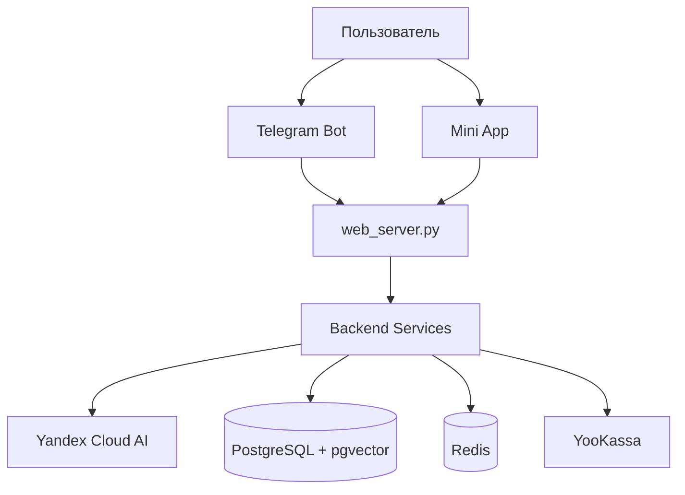

<div align="center">


# PandaPal

Образовательная платформа для школьников 1-9 классов с Telegram-ботом и веб-приложением (Mini App). Помогает детям учиться по предметам с модерацией небезопасного контента.

[](https://www.python.org/)
[](https://reactjs.org/)
[](https://www.typescriptlang.org/)
[](https://docs.astral.sh/ruff/)
[](https://github.com/pre-commit/pre-commit)
[](https://railway.app)
[](LICENSE)

[Сайт](https://pandapal.ru) • [Telegram Бот](https://t.me/PandaPalBot)

[English README](README_EN.md)

</div>

## О проекте

PandaPal — AI-помощник для учебы в формате Telegram Mini App и сайта. Основные сценарии: объяснение тем, помощь с домашними заданиями, голос/фото-вопросы, учебные игры, прогресс и премиум-подписка.

## Быстрый старт

Для локальной разработки:

```bash
# Клонирование репозитория
git clone https://github.com/gaus-1/pandapal-bot.git
cd pandapal-bot

# Установка зависимостей Python
python -m venv venv
source venv/bin/activate  # Windows: venv\Scripts\activate
pip install -r requirements.txt

# Настройка окружения
cp config/env.template .env
# Заполните .env файл с вашими API ключами

# Миграции БД
alembic upgrade head

# Запуск backend
python web_server.py

# В другом терминале - запуск frontend
cd frontend
npm install
npm run dev
```

Полная документация по установке и настройке: см. [docs/](docs/)

### Ключевые возможности

- AI-чат для учебных вопросов (обычный и streaming SSE)
- Проверка домашних заданий по фото + история и статистика
- Голосовые вопросы с подтверждением перед отправкой в AI
- Визуализации по предметам (графики, таблицы, схемы, карты)
- RAG-поиск по базе знаний с `pgvector` (`knowledge_embeddings`)
- Игры PandaPalGo: Крестики-нолики, Шашки, 2048, Эрудит
- Прогресс, достижения и геймификация
- Premium через YooKassa (299 ₽/месяц), сохранение карт
- Реферальная программа (`ref_<telegram_id>`)
- Модерация контента для детской аудитории

### Реферальная программа

Преподаватели и партнёры получают персональную ссылку вида `https://t.me/PandaPalBot?startapp=ref_<telegram_id>`.
Оплаты по ссылке учитываются в системе, размер выплаты настраивается через `REFERRAL_PAYOUT_RUB`.
Месячный отчёт: `python scripts/referral_report.py [--year YYYY] [--month MM]`.

## Технологии

### Backend

- Python 3.13, aiogram 3.24, aiohttp 3.13
- SQLAlchemy 2.0, PostgreSQL 17 + pgvector, Alembic
- Redis 7.1 (Upstash)
- Yandex Cloud: YandexGPT Pro, SpeechKit STT, Vision OCR, Translate API, Embeddings API
- YooKassa 3.9.0
- Параметры генерации по умолчанию: `temperature=0.35`, `max_tokens=8192`

### Frontend

- React 19, TypeScript 5, Vite 7
- TanStack Query 5, Zustand 5
- Tailwind CSS 3
- Telegram Mini App SDK 8.0

### Инфраструктура

- Railway (webhook режим)
- Cloudflare (DNS, SSL, CDN)
- GitHub Actions (CI/CD)
- Upstash Redis

## Структура проекта

```text
PandaPal/
├── bot/
│   ├── handlers/            # Telegram handlers (ai_chat: text/voice/image/document)
│   ├── services/            # AI, RAG, games, payments, moderation, miniapp services
│   │   ├── rag/             # vector_search, query_expander, reranker, semantic_cache, compressor
│   │   ├── games_service/   # TicTacToe, Checkers, 2048, Erudite
│   │   ├── game_engines/    # Игровые движки
│   │   └── visualization/   # Детектор и генераторы визуализаций
│   ├── api/
│   │   ├── miniapp/         # chat, chat_stream (SSE), homework, progress, other
│   │   ├── auth_endpoints.py
│   │   ├── premium_endpoints.py
│   │   ├── games_endpoints.py
│   │   └── validators.py
│   ├── config/
│   ├── security/
│   ├── monitoring/
│   ├── models/
│   └── database/
├── frontend/
│   ├── src/                 # components, features, hooks, services, store
│   └── public/
├── tests/                   # unit, integration, e2e, security, resilience, performance
├── alembic/
├── scripts/
├── server_routes/
└── web_server.py
```

## Архитектура

### Обзор системы



### API Endpoints

- `POST /api/miniapp/ai/chat` — non-streaming чат
- `POST /api/miniapp/ai/chat-stream` — streaming чат (SSE)
- `POST /api/miniapp/homework/check` — проверка ДЗ по фото
- `GET /api/miniapp/homework/history/{telegram_id}`
- `GET /api/miniapp/progress/{telegram_id}`
- `GET /api/miniapp/premium/status/{telegram_id}`
- `POST /api/miniapp/games/{telegram_id}/create`

## Безопасность

- Валидация владельца ресурса через `X-Telegram-Init-Data` для защищенных endpoints
- Pydantic v2 для валидации входных данных
- SQLAlchemy ORM и параметризация запросов
- Модерация контента (многоуровневая фильтрация)
- Rate limiting и базовая защита API
- Секреты только в env переменных

Сообщить об уязвимости: см. [SECURITY.md](.github/SECURITY.md)

## Тестирование

- Наборы тестов: `unit`, `integration`, `e2e`, `security`, `resilience`, `performance`

Запуск:

```bash
pytest tests/ -v
```

### Частые проблемы локального запуска

- **Не стартует backend**: проверьте `.env` и обязательные переменные из `config/env.template`.
- **Ошибки миграций**: выполните `alembic upgrade head` и убедитесь, что `DATABASE_URL` указывает на рабочую БД.
- **Frontend не открывается**: запустите `npm run dev` из `frontend/` и проверьте порт в выводе Vite.
- **Проблемы с Telegram Mini App**: для локальной проверки открывайте веб-режим отдельно от Telegram-контекста.

## Наполнение базы знаний (RAG)

Для семантического поиска нужно проиндексировать материалы в `knowledge_embeddings`:

```bash
railway link   # выбрать проект PandaPal
railway run python scripts/update_knowledge_base.py
```

Используются учебные источники, а также материалы энциклопедического формата (включая Wikipedia) в RAG-пайплайне.

## Переменные окружения (Railway / локально)

Обязательные переменные для запуска описаны в `config/env.template`:

- `DATABASE_URL`, `TELEGRAM_BOT_TOKEN`
- `YANDEX_CLOUD_API_KEY`, `YANDEX_CLOUD_FOLDER_ID`
- `SECRET_KEY`
- Для Premium: `YOOKASSA_SHOP_ID`, `YOOKASSA_SECRET_KEY` и др.

## Лицензия

Это проприетарное программное обеспечение. Все права защищены.

Подробности: см. [LICENSE](LICENSE)

## Контакты

- Сайт: https://pandapal.ru
- Telegram Бот: https://t.me/PandaPalBot
- GitHub: https://github.com/gaus-1/pandapal-bot

## GitHub Topics

`telegram-bot` `education` `ai-assistant` `yandex-cloud` `react` `typescript` `python` `postgresql` `pgvector` `rag` `educational-platform` `kids-learning` `homework-helper` `aiogram` `mini-app`
