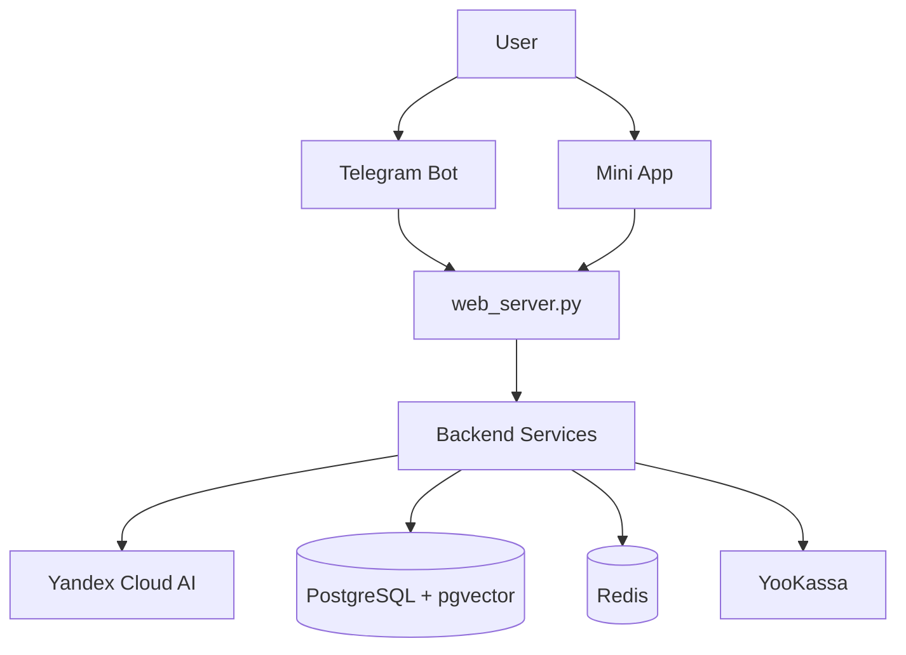

<div align="center">


# PandaPal

Educational platform for grades 1-9 with a Telegram bot and web Mini App. It helps children study school subjects with unsafe-content moderation.

[](https://www.python.org/)
[](https://reactjs.org/)
[](https://www.typescriptlang.org/)
[](https://github.com/psf/black)
[](https://github.com/pre-commit/pre-commit)
[](https://railway.app)
[](LICENSE)

[Website](https://pandapal.ru) • [Telegram Bot](https://t.me/PandaPalBot)

</div>

## About the Project

PandaPal is an AI learning assistant available as a Telegram Mini App and website. Core flows: topic explanations, homework help, voice/photo questions, educational games, progress tracking, and premium subscription.

## Quick Start

For local development:

```bash
# Clone repository
git clone https://github.com/gaus-1/pandapal-bot.git
cd pandapal-bot

# Install Python dependencies
python -m venv venv
source venv/bin/activate  # Windows: venv\Scripts\activate
pip install -r requirements.txt

# Setup environment
cp config/env.template .env
# Fill .env file with your API keys

# Database migrations
alembic upgrade head

# Run backend
python web_server.py

# In another terminal - run frontend
cd frontend
npm install
npm run dev
```

Full installation details: [docs/](docs/)

### Key Features

- AI chat for educational questions (regular and SSE streaming)
- Homework checking from photos + history/statistics
- Voice questions with confirmation before AI submit
- Subject visualizations (graphs, tables, schemes, maps)
- RAG search with `pgvector` in `knowledge_embeddings`
- PandaPalGo games: Tic-Tac-Toe, Checkers, 2048, Erudite
- Progress, achievements, and gamification
- Premium via YooKassa (299 RUB/month), saved cards
- Referral program (`ref_<telegram_id>`)
- Multi-layer content moderation for child safety

### Referral Program

Teachers and partners receive links like `https://t.me/PandaPalBot?startapp=ref_<telegram_id>`.
Paid subscriptions via referral are tracked; payout amount is configurable via `REFERRAL_PAYOUT_RUB`.
Monthly report: `python scripts/referral_report.py [--year YYYY] [--month MM]`.

## Technologies

### Backend

- Python 3.13, aiogram 3.24, aiohttp 3.13
- SQLAlchemy 2.0, PostgreSQL 17 + pgvector, Alembic
- Redis 7.1 (Upstash)
- Yandex Cloud: YandexGPT Pro, SpeechKit STT, Vision OCR, Translate API, Embeddings API
- YooKassa 3.9.0
- Default generation params: `temperature=0.35`, `max_tokens=8192`

### Frontend

- React 19, TypeScript 5, Vite 7
- TanStack Query 5, Zustand 5
- Tailwind CSS 3
- Telegram Mini App SDK 8.0

### Infrastructure

- Railway (webhook mode)
- Cloudflare (DNS, SSL, CDN)
- GitHub Actions (CI/CD)
- Upstash Redis

## Project Structure

```text
PandaPal/
├── bot/
│   ├── handlers/            # Telegram handlers (ai_chat: text/voice/image/document)
│   ├── services/            # AI, RAG, games, payments, moderation, miniapp services
│   │   ├── rag/             # vector_search, query_expander, reranker, semantic_cache, compressor
│   │   ├── games_service/   # TicTacToe, Checkers, 2048, Erudite
│   │   ├── game_engines/
│   │   └── visualization/
│   ├── api/
│   │   ├── miniapp/         # chat, chat_stream (SSE), homework, progress, other
│   │   ├── auth_endpoints.py
│   │   ├── premium_endpoints.py
│   │   ├── games_endpoints.py
│   │   └── validators.py
│   ├── config/
│   ├── security/
│   ├── monitoring/
│   ├── models/
│   └── database/
├── frontend/
│   ├── src/                 # components, features, hooks, services, store
│   └── public/
├── tests/                   # unit, integration, e2e, security, resilience, performance
├── alembic/
├── scripts/
├── server_routes/
└── web_server.py
```

## Architecture

### System Overview



### API Endpoints

- `POST /api/miniapp/ai/chat` — non-streaming chat
- `POST /api/miniapp/ai/chat-stream` — streaming chat (SSE)
- `POST /api/miniapp/homework/check` — homework check by photo
- `GET /api/miniapp/homework/history/{telegram_id}`
- `GET /api/miniapp/progress/{telegram_id}`
- `GET /api/miniapp/premium/status/{telegram_id}`
- `POST /api/miniapp/games/{telegram_id}/create`

## Security

- Resource-owner validation via `X-Telegram-Init-Data` on protected endpoints
- Input validation with Pydantic v2
- SQLAlchemy ORM with parameterized queries
- Multi-layer content moderation
- API rate limiting
- Secrets only in environment variables

Report vulnerabilities: see [SECURITY.md](.github/SECURITY.md)

## Testing

- Test suites: `unit`, `integration`, `e2e`, `security`, `resilience`, `performance`
- Current structure: 50+ unit files, 40+ integration files, 5 e2e files

Run:

```bash
pytest tests/ -v
```

## Knowledge Base Indexing (RAG)

To enable semantic search, index materials into `knowledge_embeddings`:

```bash
railway link   # select PandaPal project
railway run python scripts/update_knowledge_base.py
```

The project uses educational sources and encyclopedic materials (including Wikipedia) in the RAG pipeline.

## Environment Variables (Railway / local)

Required variables are listed in `config/env.template`:

- `DATABASE_URL`, `TELEGRAM_BOT_TOKEN`
- `YANDEX_CLOUD_API_KEY`, `YANDEX_CLOUD_FOLDER_ID`
- `SECRET_KEY`
- Premium: `YOOKASSA_SHOP_ID`, `YOOKASSA_SECRET_KEY`, etc.

## License

This is proprietary software. All rights reserved.

Details: see [LICENSE](LICENSE)

## Contacts

- Website: https://pandapal.ru
- Telegram Bot: https://t.me/PandaPalBot
- GitHub: https://github.com/gaus-1/pandapal-bot

## GitHub Topics

`telegram-bot` `education` `ai-assistant` `yandex-cloud` `react` `typescript` `python` `postgresql` `pgvector` `rag` `educational-platform` `kids-learning` `homework-helper` `aiogram` `mini-app`
